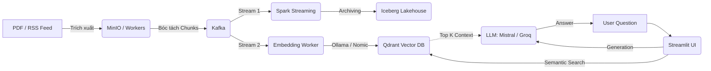

# Smart Dev-Docs Platform

<p align="center">
  
  
  
  
  
  
  
  
</p>

## Tổng Quan Kiến Trúc

**Smart Dev-Docs Platform** là một nền tảng RAG xây dựng thuần Cloud-Native trên Kubernetes (Minikube). Hệ thống được thiết kế theo kiến trúc **Event-Driven AI Pipeline**, cho phép tiêu thụ dữ liệu lớn (sách PDF, Blog), xử lý theo luồng, tạo Embedding để phục vụ các truy vấn hỏi đáp phức tạp và tóm tắt các blog công nghệ


| Thành phần | Công nghệ | Namespace | Vai trò trong hệ thống |
|------------|-----------|-----------|-----------|
| **Tiếp nhận & Hàng đợi** | Kafka (KRaft) | `kafka-kraft` | Event bus trung tâm tiếp nhận text chunks & tasks |
| **Xử lý Luồng** | Spark Streaming | `spark` | Kéo dữ liệu từ Kafka, ETL và lưu trữ vào Data Lake |
| **Lưu trữ Cấu trúc** | Iceberg + Hive (Postgres) | `hive` / `postgres`| Lưu trữ ACID và quản lý Schema (Data Lakehouse) |
| **Lưu trữ Ngữ nghĩa** | Qdrant | `qdrant` | Vector DB lưu trữ Embeddings cho tìm kiếm Semantic |
| **Lưu trữ Object** | MinIO | `minio` | S3-compatible storage lưu trữ các file PDF thô |
| **Bộ não AI (Local)**| Ollama (`mistral`, `nomic`) | `ollama` | Sinh Embeddings & Local Inference (100% Offline) |
| **Bộ não AI (Cloud)**| Groq API (Llama-3.3)| - | Tối ưu hóa truy vấn siêu tốc (Alternative) |
| **Giao diện người dùng** | Streamlit | `streamlit` | Giao diện Web để tương tác với hệ thống |

---

## Data Pipeline Flow



---

## Về Kỹ Thuật

### 1. Xử lý Tài liệu Đa phương tiện
Để đảm bảo chất lượng phản hồi cao nhất, hệ thống không chỉ đọc văn bản thô mà còn xử lý các thành phần phức tạp trong tài liệu kỹ thuật:
- **Xử lý PDF đa phương tiện (Multimodal PDF):** Sử dụng thư viện `unstructured` để trích xuất văn bản và hình ảnh từ file PDF. Sau đó, sử dụng mô hình thị giác máy tính **LLaVa** (chạy qua Ollama) để "nhìn" hình ảnh và sinh ra một đoạn mô tả kỹ thuật (Technical Description) tóm tắt nội dung hình ảnh đó. Đoạn text này sau đó được gắn kèm vào ngữ cảnh của trang tài liệu
- **Trích xuất Bảng (Tables):** Sử dụng thư viện `pdfplumber` để nhận diện các bảng biểu, sau đó tự động chuyển đổi chúng về định dạng **Markdown**. Việc này giúp giữ nguyên cấu trúc hàng/cột, cho phép LLM hiểu được các so sánh và dữ liệu thống kê chính xác hơn so với việc đọc text rời rạc
- **Phân đoạn thông minh (Chunking):** Văn bản sau khi làm sạch được chia nhỏ bằng `RecursiveCharacterTextSplitter` với kích thước ~900 ký tự và độ gối đầu (overlap) 150 ký tự, đảm bảo tính liên kết thông tin giữa các đoạn
- Tuy vậy việc xử lý multimodal PDF tốn nhiều tài nguyên và thời gian hơn so với việc xử lý PDF chỉ chứa văn bản, nên chúng tôi có tạo thêm 1 pipeline xử lý PDF chỉ chứa văn bản để rút ngắn thời gian xử lý của hệ thống khi chỉ muốn kiểm thử hoặc khi không có nhu cầu xử lý hình ảnh trong tài liệu

### 2. Pipeline Tóm tắt Blog Công nghệ
Hệ thống giúp lập trình viên cập nhật kiến thức liên tục thông qua luồng tự động:
- **Cào dữ liệu (Crawling):** Một robot crawler chạy định kỳ để lấy thông tin từ các RSS Feed của các cộng đồng lớn như Reddit (r/programming), Dev.to và Github Trending
- **Tóm tắt bằng AI:** Thay vì đọc toàn bộ bài báo dài, hệ thống sử dụng **Groq (Llama-3.3)** hoặc **Local Mistral** để cô đọng nội dung thành 5-6 ý cốt lõi (Key Takeaways). Các bản tóm tắt này giúp tiết kiệm thời gian mà vẫn đảm bảo nắm bắt được xu hướng công nghệ mới nhất

### 3. Xử lý Dữ liệu Lớn & Lưu trữ (Spark, Kafka & Iceberg)
Hệ thống được thiết kế để có thể mở rộng theo mô hình Cloud-Native:
- **Kafka (The Backbone):** Đóng vai trò là hàng đợi sự kiện trung tâm. Mọi phân đoạn văn bản và bài blog đã tóm tắt đều được đẩy vào các topic Kafka (`document-events`, `blog-events`). Điều này giúp hệ thống tách biệt luồng Ingest và luồng Process, tăng khả năng chịu lỗi
- **Spark Streaming & ETL:** Một ứng dụng Spark chạy trong Kubernetes liên tục lắng nghe Kafka. Khi có dữ liệu mới, Spark sẽ thực hiện chuẩn hóa và lưu trữ vào **Apache Iceberg**
- **Apache Iceberg (Data Lakehouse):** Đây là lớp lưu trữ dữ liệu. Iceberg cung cấp các tính năng cao cấp như ACID transactions (đảm bảo dữ liệu không bị lỗi khi ghi/đọc đồng thời) và **Time Travel**, cho phép truy vấn lại các phiên bản dữ liệu cũ của hệ thống một cách hiệu quả qua Spark SQL

---

## Đánh giá Hệ thống

### 1. Phân Tích & Ingest Dữ Liệu (PDF / Blogs)
- **Luồng hoạt động**: File PDF -> MinIO -> bóc tách `Unstructured` -> Text Chunks -> Kafka -> Ollama `nomic-embed-text` -> Qdrant
- **Thời gian xử lý Embeddings (Local)**:
  - Việc vector hóa văn bản (Embedding) tốn **~0.1s - 0.5s** cho mỗi chunk
  - Một cuốn sách 100 trang sẽ bị chia thành ~500 chunks, luồng nắn dòng bắt buộc phải giới hạn tốc độ đẩy vào Kafka để Ollama không bị nghẽn (có thể tiêu tốn **5-15 phút / tài liệu**)
- **Iceberg Storage**: Spark Streaming hấp thụ events từ Kafka gần như tức thời (delay < 3s). Lưu lượng ghi Iceberg Parquet nhỏ nên không tốn I/O

### 2. Tóm tắt Blog Công nghệ
- **Chất lượng**: Hệ thống dùng Llama/Mistral để đọc nguyên nội dung thô và tóm tắt thành 3 ý chính. Kết quả cực kỳ chính xác vì không bị phụ thuộc vào Vector DB
- **Thời gian phản hồi**: 
  - **Local Ollama (mistral:7b)**: Bị nghẽn do không GPU. Có thể tốn **20 - 45 giây** (hoặc hơn) để sinh tóm tắt cho một bài báo dài 3000 từ. (ngốn >80% CPU của máy)
  - **Groq API**: Phản hồi dưới **2 giây** với chất lượng cao hơn (`llama-3.3-70b-versatile`)

### 3. Hỏi - Đáp Truy Vấn Ngữ Nghĩa
- **Thời gian truy xuất Vector (Qdrant)**: Độ trễ **< 15ms** để tìm ra Top-K (4 hoặc 5) đoạn Chunk khớp ngữ nghĩa với câu hỏi nhất từ dữ liệu sách/tài liệu
- **Chất lượng Câu Trả Lời**:
  - LLM kết hợp tốt dữ liệu trả về từ Qdrant để khoanh vùng trả lời, không bị Halucination. Nếu tài liệu không chứa dữ liệu, mô hình sẽ phản hồi "Không tìm thấy nội dung"
  - Do hạn chế Token Context của Ollama cấu hình mặc định (2048/4096), nếu trộn vào quá 8 Chunks, LM có khả năng "thiếu não" quên lời. Đề xuất lý tưởng: cấu hình **Top-K = 4**
- **Thời gian sinh câu trả lời (Inference)**:
  - **Mistral:7b (Local)**: Sinh token với tốc độ **2-5 Tokens / giây**. Tổng thời gian cho một câu trả lời hoàn chỉnh tốn khoảng **30 - 60 giây**
  - **Groq API**: Sinh token với ấn tượng **~300-800 Tokens / giây**. Câu trả lời dài cả đoạn văn hoàn tất chỉ trong vòng **1.5 giây**

---

## Hướng dẫn chạy tóm tắt

> Để xem hướng dẫn siêu chi tiết (cài đặt từng dòng lệnh), hãy đọc file [`How-to-run.md`](How-to-run.md).

### Khởi động Hạ tầng

```bash
kubectl apply -f config/systems.yml
```

### Chạy các Pipeline Xử Lý
> Nạp dữ liệu PDF vào data/books trước khi chạy các lệnh xử lý tài liệu
```bash
# Multimodal (dành cho các tài liệu chứa hình ảnh và biểu đồ) – mặc định
bash ./k8s/build.sh pipeline --source-dir data/books

# Các tài liệu chỉ chứa plain text (nhanh hơn)
bash ./k8s/build.sh pipeline --source-dir data/books --no-multimodal

# Crawl và tóm tắt Blog tự động
bash ./k8s/build.sh crawl

# Khởi chạy Giao diện Dashboard Hỏi-đáp
bash ./k8s/build.sh ui
```

Mở Streamlit tại địa chỉ: **http://localhost:8501**
Mở Grafana tại địa chỉ: **http://localhost:3000** (admin/admin)

### Gỡ Cài Đặt
```bash
minikube delete
```

---
**Demo video**: https://youtu.be/ESuTjHjv7BQ
**Tác giả:** [Lê Thanh Bình], [Phạm Hồng Minh Tú], [Trần Hải Đăng] \\ Last modify: 03/05/2026
