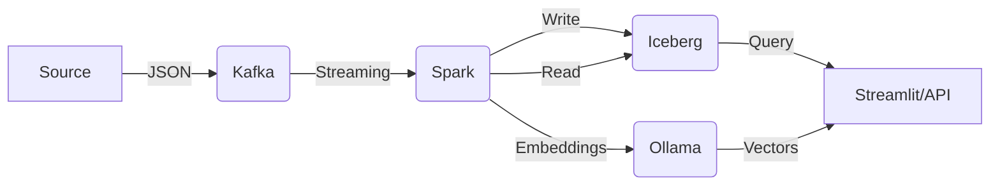

# Smart Dev-Docs Platform - Hướng dẫn sử dụng

<p align="center">
  
  
  
  
  
</p>

---

## 📋 Tổng quan

**Smart Dev-Docs Platform** là nền tảng xử lý dữ liệu streaming kết hợp với AI, triển khai trên Kubernetes (Minikube).

| Thành phần | Công nghệ | Namespace | Chức năng |
|------------|-----------|-----------|-----------|
| **Ingestion** | Kafka (KRaft) | `kafka-kraft` | Tiếp nhận dữ liệu streaming |
| **Processing** | Spark Streaming | `spark` | Xử lý real-time, ghi Iceberg |
| **Storage** | Iceberg + Hive | `hive` | Lưu trữ ACID, quản lý metadata |
| **AI/ML** | Ollama | `ollama` | Embeddings & Inference |
| **Metadata** | PostgreSQL | `postgres` | Hive Metastore backend |

---

## 🚀 Bắt đầu nhanh

### 1. Triển khai hệ thống

```bash
# Áp dụng cấu hình
kubectl apply -f config/systems.yml

# Kiểm tra pods
kubectl get pods -A
```

**Kết quả mong đợi:**
```
NAMESPACE     NAME                                     READY   STATUS
hive          metastore-xxx                            1/1     Running
kafka-kraft   kafka-0                                   1/1     Running
ollama        ollama-xxx                                1/1     Running
postgres      postgres-xxx                              1/1     Running
spark         spark-streaming-xxx                       1/1     Running
```

### 2. Kiểm tra services

```bash
# Spark logs
kubectl logs -f -n spark deployment/spark-streaming

# Kafka topics
kubectl exec -n kafka-kraft kafka-0 -- kafka-topics --list --bootstrap-server localhost:9092
```

---

## 📤 Gửi dữ liệu vào Kafka

### Tạo topic

```bash
kubectl exec -n kafka-kraft kafka-0 -- kafka-topics \
  --bootstrap-server localhost:9092 \
  --create \
  --topic document-events \
  --partitions 1 \
  --replication-factor 1
```

### Gửi test data

```bash
kubectl exec -n kafka-kraft -it kafka-0 -- kafka-console-producer \
  --bootstrap-server localhost:9092 \
  --topic document-events
```

**Paste các messages sau:**
```json
{"doc_id": "doc1", "chunk_id": "chunk1", "content": "Apache Iceberg is a high-performance format for huge analytic tables", "timestamp": 1771146503}
{"doc_id": "doc1", "chunk_id": "chunk2", "content": "Iceberg brings SQL reliability to data lakes", "timestamp": 1771146504}
{"doc_id": "doc2", "chunk_id": "chunk1", "content": "Spark Streaming processes real-time data from Kafka", "timestamp": 1771146505}
```

---

## 🔍 Kiểm tra dữ liệu trong Iceberg

### Cách 1: Spark Shell

```bash
# Vào Spark Shell
kubectl exec -n spark -it deployment/spark-streaming -- /opt/spark/bin/spark-shell

# Đọc dữ liệu
scala> spark.read.parquet("/opt/iceberg/warehouse/db/doc_chunks/data/*.parquet").show(false)

# Thoát
scala> :quit
```

### Cách 2: Spark SQL

```bash
kubectl exec -n spark -it deployment/spark-streaming -- /opt/spark/bin/spark-sql \
  --packages org.apache.iceberg:iceberg-spark-runtime-3.5_2.12:1.5.0 \
  --conf spark.sql.catalog.hive_prod=org.apache.iceberg.spark.SparkCatalog \
  --conf spark.sql.catalog.hive_prod.type=hive \
  --conf spark.sql.catalog.hive_prod.uri=thrift://metastore-service.hive:9083 \
  --conf spark.sql.catalog.hive_prod.warehouse=/opt/iceberg/warehouse \
  -e "SELECT * FROM hive_prod.db.doc_chunks;"
```

### Cách 3: Kiểm tra files

```bash
# Xem files trong warehouse
kubectl exec -n spark deployment/spark-streaming -- ls -la /opt/iceberg/warehouse/db/doc_chunks/data/
```

---

## 🤖 Sử dụng Ollama AI

### 1. Port-forward

```bash
# Terminal 1
kubectl port-forward -n ollama svc/ollama-service 11434:11434
```

### 2. Kiểm tra models

```bash
curl http://localhost:11434/api/tags
```

**Kết quả:**
```json
{
  "models": [
    {"name": "nomic-embed-text:latest", "size": 274302450},
    {"name": "mistral:7b-instruct", "size": 4372824384}
  ]
}
```

### 3. Tạo embeddings

```bash
curl http://localhost:11434/api/embeddings -d '{
  "model": "nomic-embed-text",
  "prompt": "Apache Iceberg is a table format for data lakes"
}'
```

Lưu ý: request đầu tiên có thể chậm 30-120 giây do model được nạp vào RAM (CPU mode), nhìn như bị "stuck" nhưng vẫn đang xử lý.

### 4. Chat với Mistral

```bash
# Non-streaming
curl http://localhost:11434/api/generate -d '{
  "model": "mistral:7b-instruct",
  "prompt": "What is Apache Iceberg?",
  "stream": false
}'

# Streaming
curl http://localhost:11434/api/generate -d '{
  "model": "mistral:7b-instruct",
  "prompt": "Explain Spark Streaming"
}'
```

Mẹo kiểm tra nhanh khi nghi bị treo:

```bash
timeout 20s curl -sS http://localhost:11434/api/tags | head
kubectl logs -n ollama deployment/ollama --tail=80
```

---

## 📊 Spark UI

```bash
# Port-forward Spark UI
kubectl port-forward -n spark deployment/spark-streaming 4040:4040

```

Mở trình duyệt: **http://localhost:4040**

---

## 🛠 Các lệnh hữu ích

### Xem logs

| Service | Command |
|---------|---------|
| Spark | `kubectl logs -f -n spark deployment/spark-streaming` |
| Kafka | `kubectl logs -f -n kafka-kraft kafka-0` |
| Ollama | `kubectl logs -f -n ollama deployment/ollama` |
| Hive | `kubectl logs -f -n hive deployment/metastore` |

### Exec vào containers

| Container | Command |
|-----------|---------|
| Spark | `kubectl exec -n spark -it deployment/spark-streaming -- /bin/bash` |
| Kafka | `kubectl exec -n kafka-kraft -it kafka-0 -- /bin/bash` |
| Ollama | `kubectl exec -n ollama -it deployment/ollama -- /bin/sh` |

### Xóa resources

```bash
# Xóa deployment
kubectl delete deployment spark-streaming -n spark

# Xóa namespace
kubectl delete ns spark

# Xóa toàn bộ hệ thống
kubectl delete -f config/systems.yml
```

---

## 📁 Cấu trúc dữ liệu

```
/opt/iceberg/warehouse/
├── db/
│   └── doc_chunks/
│       ├── data/
│       │   └── *.parquet          # Dữ liệu thực tế
│       └── metadata/
│           ├── *.metadata.json     # Schema & snapshots
│           └── *.avro              # Manifest files
```

---

## 🔄 Data Flow



1. **Source** gửi JSON vào Kafka topic `document-events`
2. **Spark Streaming** đọc, parse, transform
3. **Spark** ghi vào Iceberg table `hive_prod.db.doc_chunks`
4. **Ollama** tạo embeddings / chat
5. **Streamlit/API** query dữ liệu + AI

---

## 🐛 Troubleshooting

### 1. Spark không tìm thấy spark-submit
```bash
# Sửa image
sed -i 's|.*image:.*|          image: apache/spark:3.5.7-python3|g' config/systems.yml
kubectl apply -f config/systems.yml
```

### 2. Lỗi Ivy cache
```yaml
# Thêm vào container spark
env:
- name: IVY_CACHE_DIR
  value: /tmp/.ivy2
```

### 3. Ollama không pull được models
```bash
# Pull trực tiếp
kubectl exec -n ollama -it deployment/ollama -- ollama pull nomic-embed-text
kubectl exec -n ollama -it deployment/ollama -- ollama pull mistral:7b-instruct
```

### 4. Ollama có vẻ bị "stuck"
```bash
# Kiểm tra API còn phản hồi
timeout 20s curl -sS http://localhost:11434/api/tags | head

# Xem model đã có chưa
kubectl exec -n ollama deployment/ollama -- ollama list

# Theo dõi logs để thấy request vẫn đang xử lý
kubectl logs -f -n ollama deployment/ollama
```

Nếu logs có `POST /api/embeddings` hoặc `POST /api/generate` và status `200`, Ollama vẫn hoạt động bình thường.

### 5. Không kết nối được Kafka
```bash
# Kiểm tra kết nối
kubectl run -n spark test-kafka --image=busybox:1.36 --rm -it --restart=Never -- \
  sh -c "nc -zv kafka-service.kafka-kraft 9092"
```

---

## 📈 Monitoring

```bash
# Resource usage
kubectl top pods -A
kubectl top nodes

# Events
kubectl get events -A --sort-by='.lastTimestamp'

# Describe pod
kubectl describe pod -n spark -l app=spark-streaming
```

---

## 🎯 Kết luận

✅ **Kafka** - Nhận dữ liệu streaming  
✅ **Spark** - Xử lý real-time  
✅ **Iceberg** - Lưu trữ ACID  
✅ **Ollama** - Embeddings & Chat  
✅ **Hive** - Quản lý metadata  

---

<p align="center">
  <b>🎉 Hệ thống đã sẵn sàng! 🎉</b>
  <br>
  <i>Happy Coding!</i>
</p>
